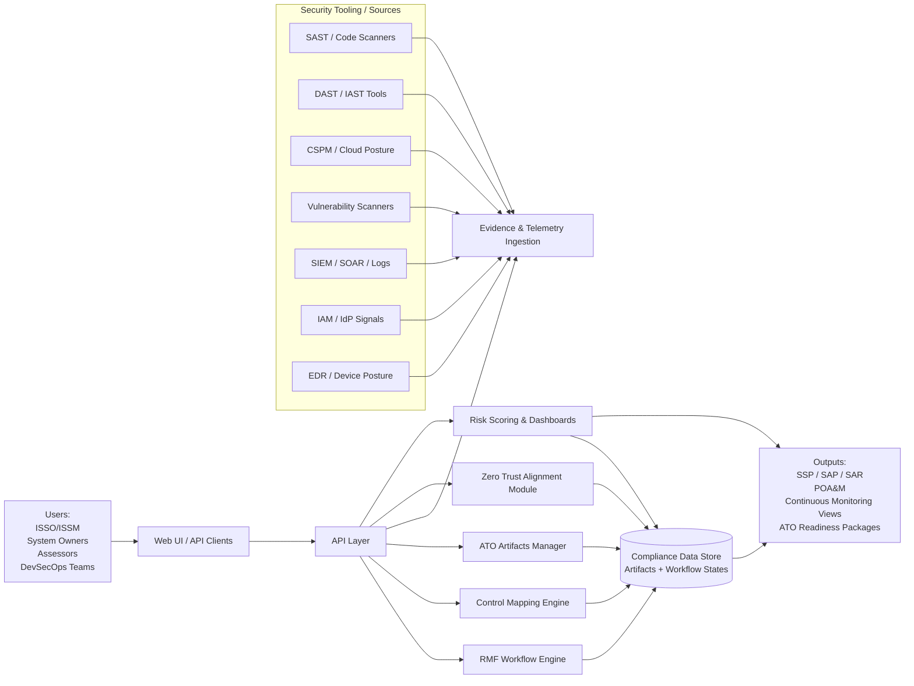

## Architecture Overview

This diagram shows the high-level architecture of the Open Federal GRC Framework.

```mermaid
flowchart LR
  %% Users
  U["Users:<br/>ISSO/ISSM<br/>System Owners<br/>Assessors<br/>DevSecOps Teams"] --> UI["Web UI / API Clients"]
  UI --> API["API Layer"]

  %% Core Services
  API --> RMF["RMF Workflow Engine"]
  API --> CM["Control Mapping Engine"]
  API --> ATO["ATO Artifacts Manager"]
  API --> EV["Evidence & Telemetry Ingestion"]
  API --> ZT["Zero Trust Alignment Module"]
  API --> RS["Risk Scoring & Dashboards"]

  %% Data Stores
  RMF --> DS[("Compliance Data Store<br/>Artifacts + Workflow States")]
  ATO --> DS
  CM --> DS
  ZT --> DS
  RS --> DS

  %% Evidence sources
  subgraph ST["Security Tooling / Sources"]
    SAST["SAST / Code Scanners"]
    DAST["DAST / IAST Tools"]
    CSPM["CSPM / Cloud Posture"]
    VULN["Vulnerability Scanners"]
    SIEM["SIEM / SOAR / Logs"]
    IAM["IAM / IdP Signals"]
    EDR["EDR / Device Posture"]
  end

  SAST --> EV
  DAST --> EV
  CSPM --> EV
  VULN --> EV
  SIEM --> EV
  IAM --> EV
  EDR --> EV

  %% Outputs
  RS --> OUT["Outputs:<br/>SSP / SAP / SAR<br/>POA&amp;M<br/>Continuous Monitoring Views<br/>ATO Readiness Packages"]
  DS --> OUT
```
